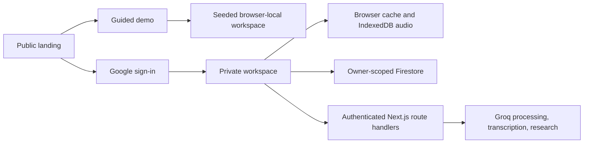
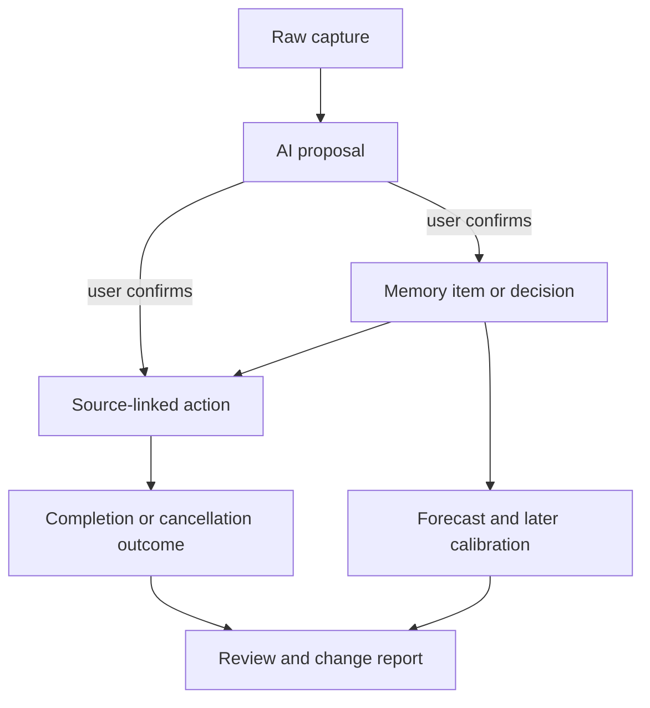

# Auxiliaire architecture

## Runtime modes

The demo and private workspace intentionally share the same React surfaces. Demo mode injects seeded `WorkspaceData`, blocks remote writes, and returns deterministic local intelligence responses. This makes the reviewer experience representative without requiring credentials or paid API calls.

## Client state

- `AuthContext` manages Firebase authentication and user profile state.
- `DemoModeContext` isolates the current tab as a guided sample session.
- `WorkspaceContext` owns captures, items, actions, daily state, recovery, import/export, and Firestore synchronization.
- `RecordingContext` saves audio to IndexedDB before any transcription request.
- `FeedbackContext` centralizes reversible confirmations and failure messages.
- `ViewModeContext` selects responsive mobile or desktop chrome.

## Evidence chain

The raw capture is never overwritten by generated structure. Actions retain `sourceCaptureId` or `sourceItemId`, allowing Today and Review to recover the evidence.

## Data boundaries

| Boundary | Contents | Behavior |
|---|---|---|
| Browser cache | Workspace JSON | Fast cache; not claimed as encrypted |
| IndexedDB | Audio blobs | Saved before transcription; included in v2 exports |
| Firestore | User profile and workspace collections | Owner-only rules under `users/{uid}` |
| Next.js APIs | Bounded request context | Firebase token verification, per-user route rate limits |
| Groq | User-initiated selected content | Processing, guidance, transcription, web research |

## API protections

- Firebase ID tokens are verified server-side with Admin Auth and an Identity Toolkit fallback.
- Email/domain allowlists are enforced on client sign-in and API authorization.
- Request sizes and context lengths are bounded.
- AI routes are rate-limited per user and route.
- Provider errors return stable, user-safe messages and preserve original workspace data.

## Verification strategy

- Unit tests cover ranking, deferred work, readiness, memory search, demo referential integrity, deterministic demo intelligence, and rate limiting.
- TypeScript, ESLint, tests, and production build run in CI.
- `evals/` contains paid, non-deterministic model regression fixtures.
- Browser verification covers the public landing, demo activation, capture-to-AI proposal, action lifecycle, responsive navigation, and review disclosure.
