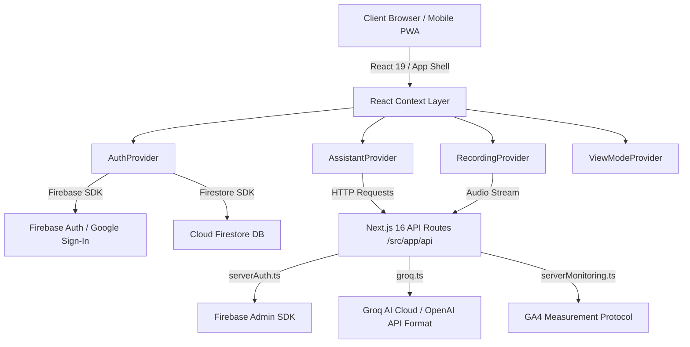
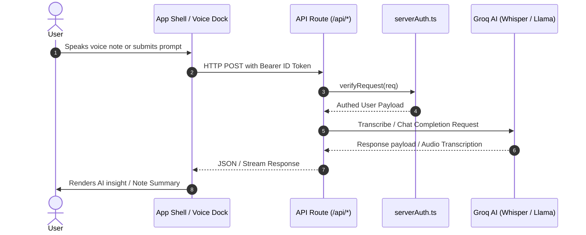

# Architecture Overview — Auxiliaire (PM OS)

Auxiliaire is a private auxiliary intelligence application built for daily readiness, capture, knowledge management, daily reviews, watchlists, and AI-assisted insights.

---

## 🏗️ High-Level System Architecture



---

## 🛠️ Technology Stack

| Layer | Technology |
| :--- | :--- |
| **Framework** | Next.js 16 (App Router with Turbopack) |
| **Runtime & Language** | Node.js (>=22), TypeScript, React 19 |
| **Styling** | Tailwind CSS v4, Vanilla CSS Custom Properties |
| **Fonts** | Plus Jakarta Sans (Primary), JetBrains Mono (Code/Secondary), Playfair Display (Editorial) |
| **Database & Auth** | Firebase Auth (Google OAuth / Email), Cloud Firestore (Offline Persistence) |
| **AI Infrastructure** | Groq AI Cloud (`llama-3.3-70b-versatile`, `whisper-large-v3-turbo`) |
| **Icons & Motion** | Lucide React, Framer Motion |

---

## 📁 Directory & Module Structure

```text
pm-os/
├── src/
│   ├── app/                    # Next.js App Router (Pages & API routes)
│   │   ├── api/                # Backend API Endpoints
│   │   │   ├── brief/          # Readiness daily briefing generation
│   │   │   ├── capture-summary/# Auto-summarization & tagging for voice/text notes
│   │   │   ├── chat/           # Conversational AI assistant endpoint
│   │   │   ├── chat-title/     # Auto-generating chat session titles
│   │   │   ├── onboard/        # AI onboarding helper
│   │   │   └── transcribe/     # Groq Whisper Speech-to-Text handler
│   │   ├── auxiliaire/         # Auxiliaire core dashboard page
│   │   ├── capture/            # Note & voice capture page
│   │   ├── dashboard/          # Today readiness dashboard
│   │   ├── knowledge/          # Knowledge base page
│   │   ├── onboarding/         # User onboarding page
│   │   ├── patterns/           # AI pattern analysis page
│   │   ├── review/             # Daily review page
│   │   ├── settings/           # User settings page
│   │   ├── watchlist/          # Item watchlist page
│   │   ├── globals.css         # Design system tokens & global styling
│   │   └── layout.tsx          # Root layout with providers & font configuration
│   ├── components/             # React UI Component Hierarchy
│   │   ├── layout/             # App Shell, Navigation, Mobile & Desktop Layouts
│   │   ├── recording/          # Recording Dock & Voice UI Controls
│   │   └── ui/                 # Reusable UI primitives (Buttons, Cards, Modals)
│   ├── context/                # Global React Context State
│   │   ├── AssistantContext.tsx# AI Assistant chat state & message history
│   │   ├── AuthContext.tsx     # Authentication, RBAC, User profile state
│   │   ├── RecordingContext.tsx# Audio recording state & media recorder engine
│   │   └── ViewModeContext.tsx # Mobile/Desktop view mode toggle state
│   └── lib/                    # Core Libraries & Utilities
│       ├── api.ts              # Client API helper utilities
│       ├── db.ts               # Firestore CRUD operations & queries
│       ├── firebase.ts         # Firebase client initialization & offline cache
│       ├── groq.ts             # Groq AI SDK client configuration
│       ├── monitoring.ts       # Client analytics logger
│       ├── readinessData.ts    # Readiness data modeling & compute
│       ├── serverAuth.ts       # Server-side Firebase ID Token verification
│       ├── serverMonitoring.ts # Server-side GA4 Measurement Protocol logger
│       └── utils.ts            # Utility functions (cn, formatters)
├── .env.example                # Environment variable reference template
├── .env.local                  # Local development environment secrets
├── .env.prod                   # Production environment configuration reference
├── next.config.ts              # Next.js build & standalone export config
└── README.md                   # Project summary & getting started guide
```

---

## 🔒 Authentication & Authorization Architecture

### 1. Client-Side Authentication (`src/context/AuthContext.tsx` & `src/lib/firebase.ts`)
- Utilizes **Firebase Authentication** supporting Google Sign-In (`GoogleAuthProvider`) and Email/Password for reviewer access.
- Restricts login by email domain if `NEXT_PUBLIC_ALLOWED_EMAIL_DOMAIN` is specified.
- Role-Based Access Control (RBAC):
  - **Super Admin**: Set via `NEXT_PUBLIC_SUPER_ADMIN_EMAIL` or `isAdmin: true` flag in Firestore user document.
  - **Admin**: Evaluated via `getAdminAccess(email)` from Firestore `admin_access` collection.

### 2. Server-Side Route Protection (`src/lib/serverAuth.ts`)
- All protected API routes wrap handlers with `withAuth()`.
- Validates the `Authorization: Bearer <ID_TOKEN>` header against **Firebase Admin SDK** (`verifyIdToken`).
- Development Bypass: Allows offline development when `DISABLE_API_AUTH=true` is configured in non-production environments.

---

## 🤖 AI & Processing Pipeline



### Groq Models & Services (`src/lib/groq.ts`)
- **Chat & Synthesis**: `GROQ_CHAT_MODEL` (`llama-3.3-70b-versatile`).
- **Speech-to-Text**: `GROQ_STT_MODEL` (`whisper-large-v3-turbo`).

---

## 💾 Data Flow & Persistence

- **Local First & Offline Support**: Firebase Firestore is configured with `persistentLocalCache` and `persistentMultipleTabManager` in `src/lib/firebase.ts` for immediate UI rendering and offline synchronization.
- **Firestore Collections**:
  - `users/{uid}`: User profile data, settings, and last activity timestamps.
  - `users/{uid}/events`: User activity logs.
  - `admin_access`: System administration control mappings.

---

## 📊 Monitoring & Telemetry

- **Client Analytics**: Handled by `src/lib/monitoring.ts` via Firebase Analytics (`logEvent`).
- **Server Analytics**: Handled by `src/lib/serverMonitoring.ts`. Transmits server-side 5xx errors directly to Google Analytics 4 via the Measurement Protocol API using `GA4_API_SECRET`.

---

## 🚀 Environment Configuration

Configuration is managed across three main environment files:
- **`.env.local`**: Local development secrets (ignored by Git).
- **`.env.example`**: Checked-in reference template for environment setup.
- **`.env.prod`**: Production configuration blueprint.
